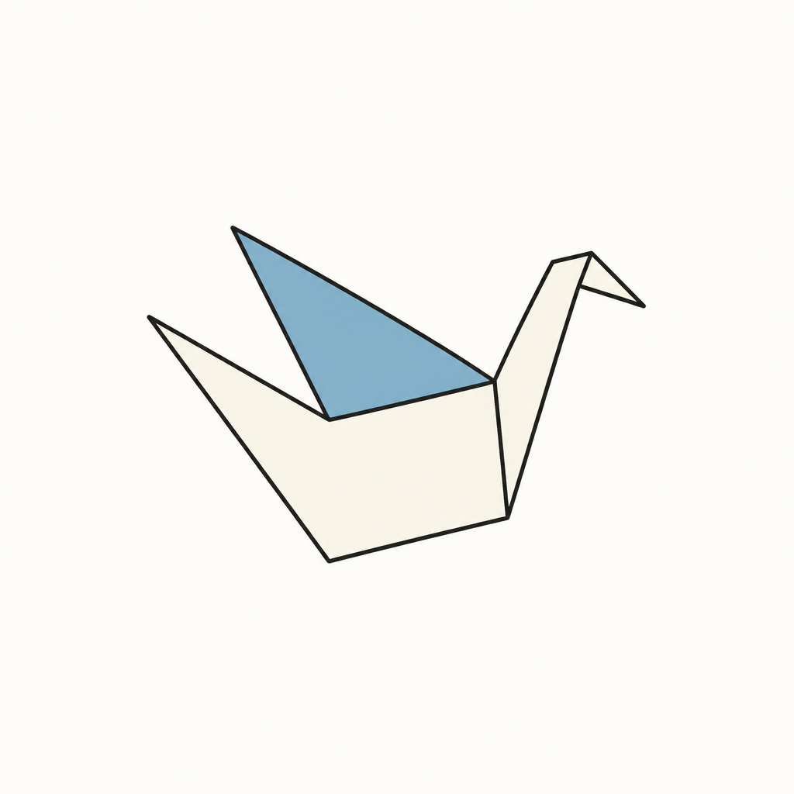

# TsuroPDF

Leitor de PDF de código aberto. Abre o arquivo, mostra a página, busca o texto e verifica assinaturas digitais.

Não é uma suíte. Completo, neste produto, é **ler sem travar**.



A marca é um tsuru de três dobras.

## O que é

TsuroPDF é um leitor nativo para o desktop, escrito em Rust ([iced](https://iced.rs/) + [Pdfium](https://pdfium.googlesource.com/pdfium/)). O alvo é qualquer PDF: grande, com tipografia exigente ou com assinatura digital.

O que ele faz cabe na barra:

- **Abrir** pelo ícone da pasta, arrastando o arquivo, ou pelo navegador vazio (pastas e últimos arquivos)
- **Páginas** — painel de miniaturas, além de anterior, próxima e o contador Página N / total
- **Zoom** — ajustar à largura, encaixar a página, `+` / `−`
- **Buscar** no texto extraído, com a conta de ocorrências
- **Assinaturas** — painel sob demanda, com o signatário e o estado criptográfico
- **Copiar** o texto selecionado, quando há seleção

Anotações e marcações fazem parte da missão; ainda não estão no visor. O que fica de fora — e deve continuar de fora — é o resto da suíte: formulários, nuvem, impressão, colaboração, qualquer função que não sirva para ler ou marcar.

## Instalar

A forma curta, com [Bun](https://bun.sh/):

```bash
bun run install:tsuro -- --install
```

Consulta a última [GitHub Release](https://github.com/claudioorjunior/tsuro-pdf/releases), baixa o artefato do seu sistema e confere o SHA-256. Sem `--install` só baixa. `--check` diz se há versão nova; `--version v0.1.0` pina uma tag.

Ou baixe o arquivo da release:

- **Mac Apple Silicon** — `TsuroPDF-{versão}-aarch64-apple-darwin.dmg`. Abra o DMG e arraste TsuroPDF para Applications.
- **Windows x64** — `TsuroPDF-{versão}-x86_64-pc-windows-msvc-setup.exe`. Instala em `%LOCALAPPDATA%\Programs\TsuroPDF`, sem admin. `/S` é a instalação silenciosa.

Ainda não há build para Mac Intel nem Linux.

**Primeira abertura no Mac.** A assinatura é ad-hoc (sem Apple Developer Program). O Gatekeeper avisa: clique com o botão direito em TsuroPDF → Abrir.

**Primeira abertura no Windows.** Se o SmartScreen aparecer: Mais informações → Executar assim mesmo.

Se ainda não houver release para o seu sistema, o script imprime o caminho de clone e sai com código 1.

### Compilar no Mac

```bash
git clone https://github.com/claudioorjunior/tsuro-pdf.git
cd tsuro-pdf
./scripts/bundle-macos.sh
```

Arraste `dist/TsuroPDF.app` para `/Applications` e abra pelo ícone. O script baixa o Pdfium, compila o visor nativo e monta o `.app`.

## Requisitos para desenvolver

- [Rust](https://rustup.rs/) estável (`rustup default stable`)
- Biblioteca [Pdfium](https://github.com/bblanchon/pdfium-binaries) no diretório do projeto ou no sistema — o `bundle-macos.sh` resolve isso no Mac

Node.js só entra se você for mexer no visor legado (Tauri + PDF.js), que não é o produto.

## Rodar a partir do código

```bash
cargo test -p tsuro-sign
cargo run -p tsuro -- public/samples/guia-folio.pdf
```

Sem argumento, a janela abre vazia. Controles ficam na barra, não em atalhos.

## Exemplos

Há dois PDFs em `public/samples/`:

| Arquivo | O que testa |
| --- | --- |
| `guia-folio.pdf` | Tipografia, tabela, acentos, busca |
| `contrato-assinado.pdf` | Campo `/Sig` com certificado autoassinado de demonstração |

O certificado do contrato é **autoassinado**. TsuroPDF trata isso como assinatura criptograficamente íntegra, mas sem cadeia de confiança pública. O estado esperado é “íntegra (sem confiança pública)”.

## Assinaturas digitais

O reconhecimento e a verificação vivem no crate Rust `tsuro-sign`:

- percorre AcroForm e dicionários `/Sig`
- lê o PKCS#7/CMS (perfil `adbe.pkcs7.detached`)
- confere o `ByteRange` e o `messageDigest`
- verifica RSA + SHA-256 sobre os atributos assinados

Estados que o painel pode mostrar: válida, íntegra (sem confiança pública), documento alterado, inválida, não suportada, certificado expirado ou ainda não válido.

## Estrutura

```
crates/tsuro            visor nativo (iced + Pdfium) — o produto
crates/tsuro-sign       motor de assinaturas (PDF + CMS)
public/samples          PDFs de exemplo
public/tsuro-mark.png   marca
src-tauri, src          visor legado (Tauri + React + PDF.js)
```

O legado continua no repositório para consulta. Não é o que se empacota como TsuroPDF.

```bash
npm install
npm run test:sign
npm run dev          # visor legado no navegador (http://127.0.0.1:43177)
npm run tauri dev
```

## Licença

[MIT](LICENSE). Contribuições de leitura, verificação e empacotamento são bem-vindas. TsuroPDF pretende continuar pequeno.
